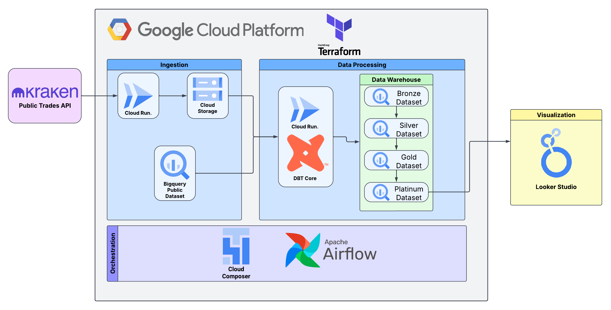
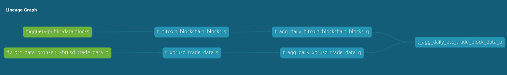
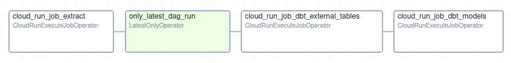
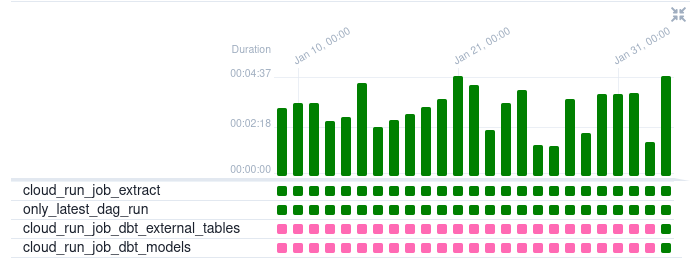
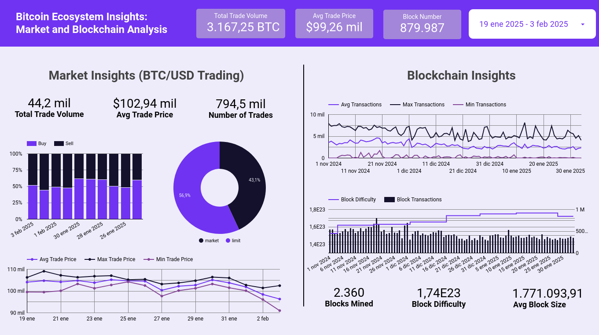
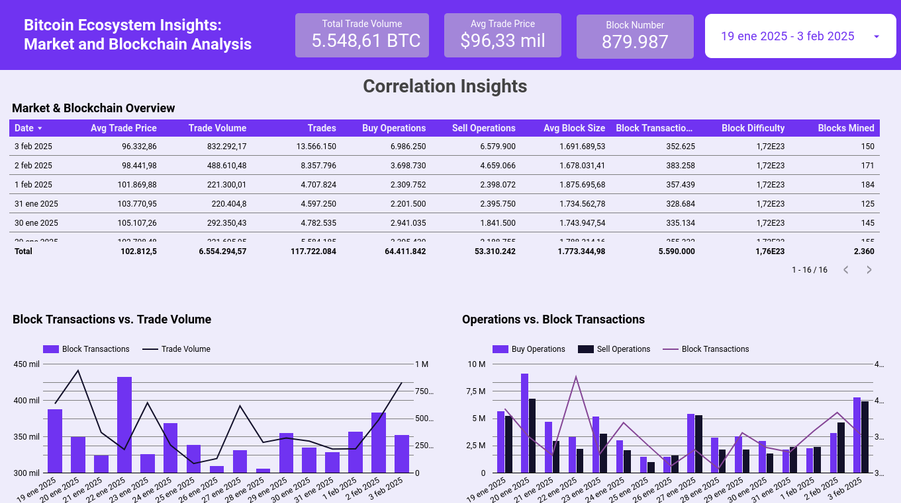

# Bitcoin Ecosystem Insights Data Engineering Project

  

## Table of Contents

- [Project Overview](#project-overview)
- [Tech Stack](#tech-stack)
- [Architecture](#architecture)
- [Data Sources](#data-sources)
- [Data Collection](#data-collection)
- [Data Warehousing](#data-warehousing)
- [Orchestration](#orchestration)
- [Visualization](#visualization)
- [Reproducibility](#reproducibility)
- [Future Improvements](#future-improvements)

## Project Overview

[Bitcoin](https://bitcoin.org/) is a decentralized digital currency, without a central bank or single administrator, that can be sent from user to user on the peer-to-peer bitcoin network without the need for intermediaries.  
The Bitcoin Ecosystem Insights Data Engineering Project aims to provide insights into the Bitcoin ecosystem by collecting, processing, and analyzing data from both the Bitcoin blockchain and Kraken cryptocurrency exchange. Combining data from these two sources allows for a more comprehensive view of the Bitcoin ecosystem, including on-chain transactions and market activity.

## Tech Stack

- **Infrastructure**: [Google Cloud Platform (GCP)](https://cloud.google.com/)
- **Infrastructure as Code**: [Terraform](https://www.terraform.io/)
- **Data Collection**: [Python](https://www.python.org/), [Kraken API](https://docs.kraken.com/api/), [Google Cloud Storage](https://cloud.google.com/storage)
- **Data Processing and Warehousing**: [DBT Core](https://github.com/dbt-labs/dbt-core), [BigQuery](https://cloud.google.com/bigquery), [SQL](https://en.wikipedia.org/wiki/SQL)
- **Containerization**: [Docker](https://www.docker.com/), [Cloud Run](https://cloud.google.com/run), [Artifact Registry](https://cloud.google.com/artifact-registry/docs/overview), [Cloud Build](https://cloud.google.com/build)
- **Orchestration**: [Airflow](https://airflow.apache.org/), [Google Cloud Composer](https://cloud.google.com/composer)
- **Visualization**: [Looker Studio](https://lookerstudio.google.com/overview)

## Architecture

The project architecture is based on a modern cloud-native data engineering stack. Data from the Bitcoin blockchain and Kraken API is collected, processed, and stored in Google BigQuery. The data is transformed and modeled using DBT to create a set of tables that are optimized for analysis and visualization. Apache Airflow is used to orchestrate the data pipeline, ensuring that the data is collected, processed, and loaded into the data warehouse on a daily basis. Looker Studio is used to visualize the data and provide insights into the Bitcoin ecosystem. The hole infrastructure is deployed on Google Cloud Platform using Terraform.

## Data Sources

The project uses two main data sources:

1. **Bitcoin Blockchain**: We use the Bitcoin blockchain as a source of on-chain transaction data. We collect this data from Google BigQuery's public dataset `bigquery-public-data.crypto_bitcoin`.

2. **Kraken API**: We use the Kraken REST API (public "Trades" endpoint) to collect market data from the Kraken cryptocurrency exchange. This data includes information on Bitcoin price, volume, and other market metrics.

## Data Collection

Data from the Bitcoin blockchain is collected directly from Google BigQuery's public dataset using SQL queries. The data is stored on a staging BigQuery table where new data is merged with existing data on a daily basis. DBT is used for this data collection process and this process is executed incrementally avoiding the need of reading the whole dataset every time.

Data from the Kraken API is collected using a command-line like Python script that makes requests to the Kraken REST API allowing to collect data by providing a date range. Data is collected and stored in Google Cloud Storage as Parquet files that are later read from BigQuery with a external table defined on DBT. Airflow dag is configured to run this process daily by calling a Cloud Run Job that executes the script with the date range of the previous day.

## Data Warehousing

Data from both the Bitcoin blockchain and Kraken API is stored in Google BigQuery. The data is transformed and modeled using DBT to create a set of tables that are optimized for analysis and visualization. A medallion like schema is used to organize the data in a way that is easy to query and understand. 

The data warehouse is updated daily with new data from both sources. DBT is used to manage the data transformation process and ensure that the data is clean, consistent, and up-to-date. The data warehouse is designed to be scalable and flexible, allowing for easy integration of new data sources and analysis tools. 

The data warehouse is divided into four layers:

1. **Bronze**: The external table that reads the raw data from the Kraken API stored in Google Cloud Storage.
2. **Silver**: The staging tables that store cleaned and deduplicated data from the Bitcoin blockchain and Kraken API.
3. **Gold**: Daily aggregated tables that provide a high-level view of the data for both sources. Nested data fields are included to provide a more detailed view of the data without aggregations.
4. **Platinum**: The final layer that combines the data from both sources to provide a comprehensive view of the Bitcoin ecosystem. This table is used for visualization and analysis in Looker Studio.

## Orchestration

The data collection, processing, and warehousing tasks are orchestrated using Apache Airflow on Google Cloud Composer. Airflow DAGs are used to schedule and run the various tasks in the pipeline, ensuring that the data is collected, processed, and loaded into the data warehouse on a daily basis.

Airflow dag follows a linear structure:

1. Call the Cloud Run Job where the python command-line script is executed to collect data from the Kraken API.
2. Check if the dag run is the latest schedule interval. If it is, continue to the next task. If not, all the following tasks are skipped. By doing this, the pipeline is able to backfill the data without running the whole pipeline.
3. Call the Cloud Run Job for DBT to create or recreate if necessary the external tables on BigQuery.
4. Call the Cloud Run Job for running the DBT models to process the data on every layer.

  

  

## Visualization

The data on the platinum last layer table is visualized using Looker Studio. Looker Studio is connected only to the Platinum table on BigQuery used as an exposition layer.
Two pages are created on Looker Studio. The first page is divided into two sections, one for the Bitcoin blockchain data and the other for the Kraken API data. The second page is a dashboard that combines data from both sources to provide a comprehensive view of the correlation between on-chain transactions and market activity. 

You can explore the Looker Studio dashboard by making a copy of the dashboard from the link below and changing the data source to your platinum table on BigQuery:

[Looker Studio Dashboard](https://lookerstudio.google.com/reporting/618bd04b-7656-4da3-a232-3234344e3e6c)

## Reproducibility

> **_NOTE:_**  For the project to run properly, you need to have a Google Cloud Platform account and enable billing. The project uses Google Cloud services that may incur costs. Make sure to review the pricing of each service before deploying the infrastructure.

The project is designed to be reproducible and scalable. The infrastructure is defined as code using Terraform, allowing for easy deployment and management of resources on Google Cloud Platform. The data collection, processing, and warehousing tasks are automated using Airflow and DBT, ensuring the pipeline runs smoothly and consistently. 

You can reproduce the project easily by following the steps below:

1. Create a Google Cloud Platform account.
2. Create a Google Cloud Project.
3. Enable the necessary APIs (Artifact Registry API, Cloud Composer API, Cloud Run Admin API) on Google Cloud Project and billing.
4. Install Terraform, and the [Google Cloud SDK](https://cloud.google.com/sdk/docs/install-sdk) on your local machine.
5. Configure Google Cloud [Application Default Credentials](https://cloud.google.com/docs/authentication/set-up-adc-local-dev-environment#google-idp).
6. Clone the project repository from GitHub.
7. Configure the project settings in the `terraform.tfvars` file. You can find an example file in the `terraform` directory.
8. Configure DBT settings in the `profiles.yml` file. You can find an example file in the `dbt/btc_analytics` directory.
9. From the root directory of the project:
   - Run `cd terraform` to navigate to the `terraform` directory.
   - Run `terraform init`, `terraform plan`, review the plan and run `terraform apply` to deploy the infrastructure.
> **_NOTE:_** Please note that the deployment process may take some time, specially the Composer environment creation wich can take up to 30 minutes.
10. **That's it!** The pipeline will now backfill the data and run automatically on a daily basis.
11. **OPTIONAL**: Make a copy of the Looker Studio dashboard from the link located in the `Visualization` section of the repository and change the data source to your platinum table on BigQuery for exploring the data.

## Future Improvements

The project can be improved in several ways:

- Data extraction from the Bitcoin blockchain can be performed with a new ingestion process exporting data to files on Google Cloud Storage so you don't need to deploy the project on US region.
- Add more tests to the project for DBT and the rest of the pipeline in general.
- Add more data sources to the project. For example, social media data for sentiment analysis.
- Compatibility with other cryptocurrencies and exchanges.
